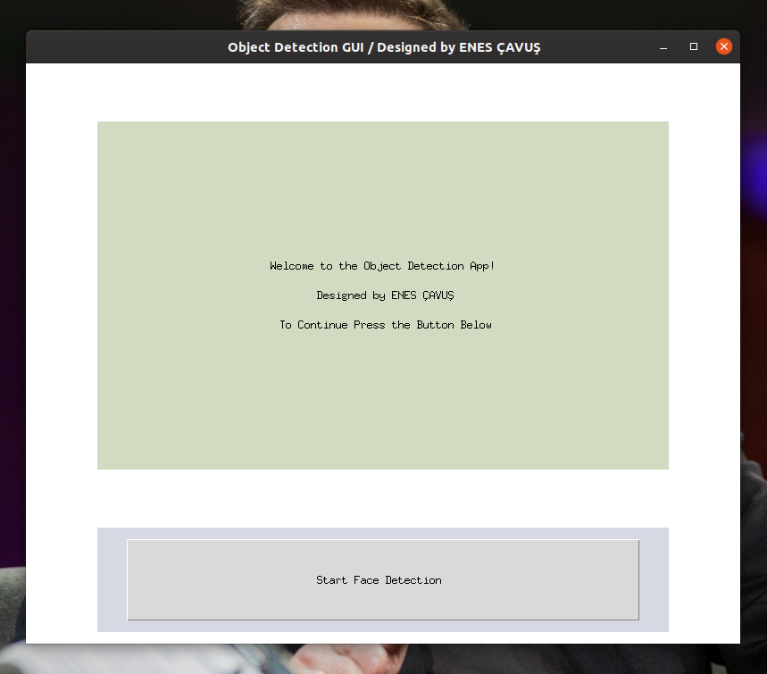
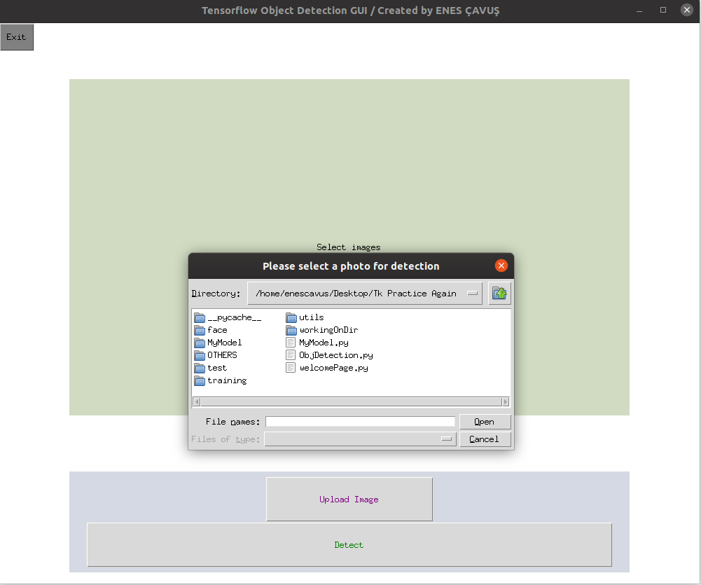
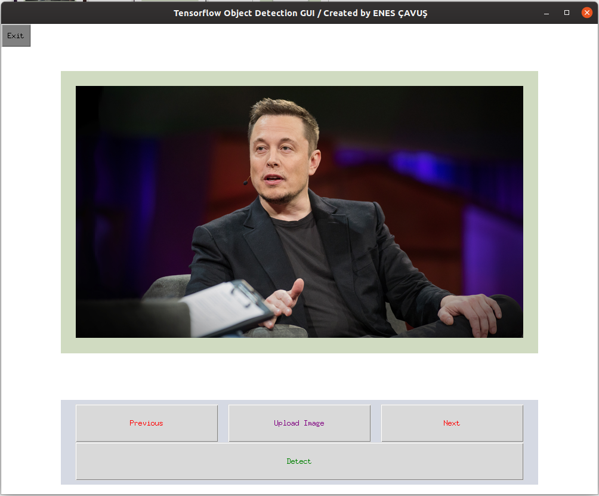
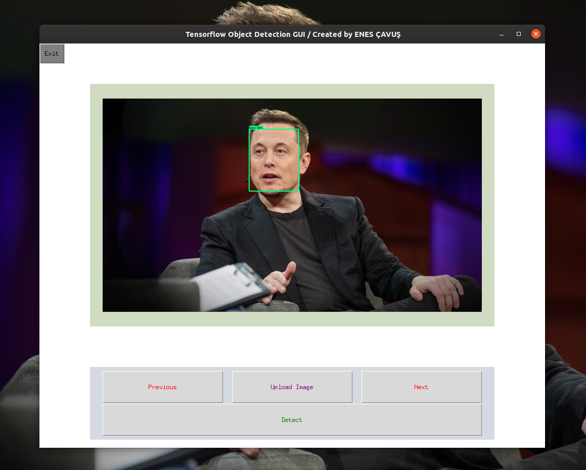

# **GUI for Tensorflow Object Detection Models**
---

**_Screen Shot 1:_**

---

**_Screen Shot 2:_**

---

At the end of the project the GUI will look like this:

**_ScreenShot 3_**

---

**_ScreenShot 4_**

---

**_Enes Çavuş_**  
Contact: [LinkedIn](https://www.linkedin.com/in/enes-%C3%A7avu%C5%9F-057376175)
